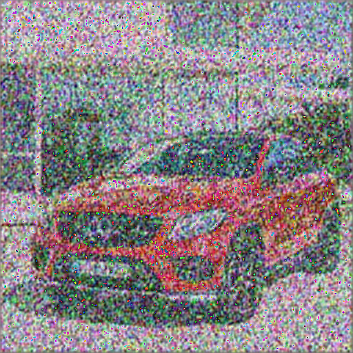

# Improving Information Quality in 6G Networks Using Semantic Auto-Encoders

Semantic Auto-Encoders for robust communications over noisy channels with LDPC coding and semantic interference cancellation (SemantIC). This repo provides:

- A semantic encoder–decoder (RED-CNN style) trained on CIFAR-10
- A GoogLeNet-like classifier to preserve task performance after compression
- A semantic interference cancellation pipeline that uses extrinsic information to aid LDPC decoding on AWGN channels

Author: Md. Iqbal Haider Khan (@ihkokil)  
Profile: https://www.linkedin.com/in/ihkokil/  
License: MIT

---

## Contents
- Overview
- Results
- Quickstart
- Train from scratch
- SemantIC testing (AWGN + LDPC + extrinsic info)
- Project structure
- Configuration and tips
- Dependencies
- Acknowledgements
- Citation
- License

---

## Overview

This sample code demonstrates how semantic auto-encoders can improve information quality in 6G-like settings by:
- Compressing images into a compact representation tailored to a downstream classifier (GoogLeNet)
- Passing the representation through a noisy channel (AWGN) with LDPC coding
- Using SemantIC (semantic interference cancellation) to inject semantic extrinsic information into the LDPC decoder, improving bit error rate and reconstruction quality

Core scripts:
- googlenet_train.py — trains a CIFAR-10 classifier
- ENC_DEC_train.py — trains the semantic encoder/decoder with a combined perceptual+task loss
- SemantIC.py — performs LDPC encoding/decoding over AWGN using extrinsic info from the semantic model

---

## Results

Below: Original vs Distorted (channel) vs SemantIC (reconstructed).  
Place your sample images at images/result/original.png, images/result/distorted.png, and images/result/semantic.png.

| Original | Distorted | SemantIC (Lossless) |
|:--:|:--:|:--:|
|  |  |  |

---

## Quickstart

Tested with:
- Python 3.13
- PyTorch 1.13.0

Install dependencies:
```bash
# (Recommended) create a fresh environment
# conda create -n semantic-6g python=3.10 -y && conda activate semantic-6g

pip install -r requirements.txt
```

Example requirements.txt:
```txt
torch==1.13.0
torchvision==0.14.0
numpy
scipy
numba
pillow
imageio
pandas
```

Dataset:
- CIFAR-10 will be auto-downloaded to ./data on first run.

GPU:
- Scripts will use CUDA if available. You can pin a GPU via the CUDA_VISIBLE_DEVICES env var inside the scripts.

---

## Train from scratch

1) Train classifier (GoogLeNet variant on CIFAR-10):
```bash
python googlenet_train.py
```
This saves weights to google_net.pkl after each epoch.

2) Train semantic encoder/decoder:
```bash
python ENC_DEC_train.py --alpha 0.8 --pretrain_epoch 0
```
- alpha controls task loss weight in the combined loss
- compression_rate is defined inside ENC_DEC_train.py (default 0.3)
- Saves:
  - semantic_coder.pkl
  - google_net_final-lambda-XX.pkl (if used)
  - sample reconstructions to images/
  - logs (accuracy/PSNR) to ./CIFAR/MLP_sem_CIFAR/*.csv

---

## SemantIC testing (AWGN + LDPC + extrinsic info)

Run SemantIC (no training required if you have semantic_coder.pkl):
```bash
python SemantIC.py
```

What it does:
- Loads CIFAR-10 images and the semantic coder (semantic_coder.pkl if present)
- Binarizes latent (8-bit), encodes with LDPC (n=900, d_v=2, d_c=3)
- Transmits over AWGN with SNR ∈ {-5, ..., 9} dB
- Iteratively decodes with LDPC, injecting semantic extrinsic LLR info
- Saves per-SNR images and metrics:
  - images/snr{snr}/origin-semantic-{epoch}-{iter}.png
  - CSV logs at images/snr{snr}.csv with BER and ED (energy distance) metrics

You can customize:
- Epochs, batch size: in SemantIC.py (epoch_len, batch_size)
- SNR range: in the main loop (range(-5, 10))
- LDPC params: n_code, d_v, d_c inside SemantIC()

---

## Project structure

```
.
├── ENC_DEC_train.py                # train semantic encoder/decoder (RED-CNN style)
├── googlenet_train.py              # train GoogLeNet-like classifier on CIFAR-10
├── SemantIC.py                     # LDPC + AWGN + semantic extrinsic info loop
├── LDPC/
│   ├── code.py
│   ├── decoder.py
│   ├── encoder.py
│   ├── ldpc_audio.py
│   ├── ldpc_images.py
│   ├── utils.py
│   ├── utils_audio.py
│   └── utils_img.py
├── images/                         # outputs (created automatically)
│   └── result/                     # sample images for README
│       ├── original.png
│       ├── distorted.png
│       └── semantic.png
├── data/                           # CIFAR-10 cache (auto-downloaded)
├── requirements.txt
└── readme.md
```

---

## Configuration and tips

- Training options (ENC_DEC_train.py):
  - --alpha: semantic classification loss weight (default 0.8)
  - --pretrain_epoch: MSE-only warmup epochs (default 0)
  - compression_rate: set inside the script (default 0.3), used to balance MSE vs task loss (lambda1/lambda2)

- Image size:
  - All pipelines resize CIFAR-10 to 96×96 and normalize to [-1, 1]

- Checkpoints:
  - Classifier: google_net.pkl or google_net_final-lambda-XX.pkl
  - Semantic coder: semantic_coder.pkl

- GPU:
  - Scripts set CUDA_VISIBLE_DEVICES='0' by default. Change this in the file or via environment variables.

- Outputs:
  - ENC_DEC_train.py: saves sample side-by-side images under images/
  - SemantIC.py: saves per-SNR images and CSV logs to images/snr{snr}/ and images/snr{snr}.csv

- Adapting to another semantic backbone:
  - Replace the encoder/decoder logic in class SemanticNN (SemantIC.py)
  - Keep enc() to output a bitstream (via quantize+binarize) and dec() to reconstruct

---

## Dependencies

- Python 3.10–3.13
- PyTorch 1.13.0 (or compatible)
- torchvision
- numpy, scipy, numba
- pillow, imageio
- pandas

Install via:
```bash
pip install -r requirements.txt
```

---

## Acknowledgements

- LDPC code adapted from: https://github.com/hichamjanati/pyldpc
- Semantic training examples adapted from:
  - https://github.com/SJTU-mxtao/Semantic-Communication-Systems
  - https://arxiv.org/abs/2205.00271

This framework can be adapted to other semantic neural networks by revising the class SemanticNN in SemantIC.py.

---

## Citation

If you use this code, please cite:
```
@software{Khan_Semantic6G_2025,
  author  = {Md. Iqbal Haider Khan},
  title   = {Improving Information Quality in 6G Networks Using Semantic Auto-Encoders},
  year    = {2025},
  url     = {https://github.com/ihkokil/6G-Semantic-Communication},
  note    = {MIT License}
}
```

---

## License

MIT License © Md. Iqbal Haider Khan (@ihkokil)

See LICENSE for details.